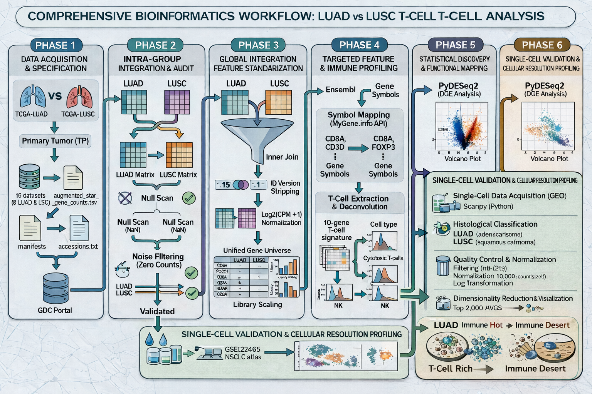
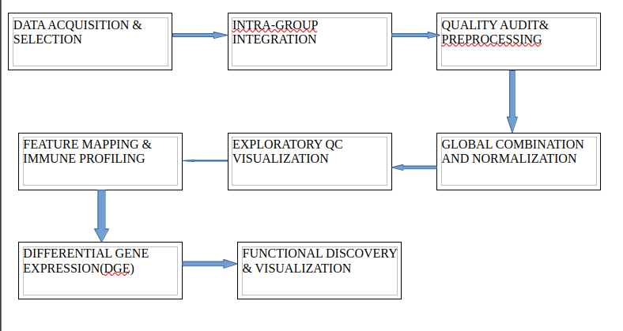

  T-CELL EXPRESSION ANALYSIS IN LUNG CANCER: A LUAD VS LUSC STUDY

  TABLE OF CONTENTS
  
[BACKGROUND](#BACKGROUND)                                                                   

[PROJECT OVERVIEW](#PROJECT_OVERVIEW)

[OBJECTIVES](#OBJECTIVES)

[WORKFLOW](#WORKFLOW)

[PIPELINE ARCHITECTURE](#PIPELINE_ARCHITECTURE)

[CODE AVAILABILITY](#CODE_AVAILABILITY)

[T-CELL LINEAGE USED](#T-CELL_LINEAGE_USED)

[T-CELL LINEAGE USED](#T-CELL_LINEAGE_USED)

[KEY FINDINGS AND KEY TAKEAWAYS](#KEY_FINDINGS_AND_KEY_TAKEAWAYS)

[REPOSITORY STRUCTURE](#REPOSITORY_STRUCTURE)

[TOOLS & SOFTWARE](#TOOLS_&_SOFTWARE)

[LICENSE](#LICENSE)

[CONTRIBUTORS](#CONTRIBUTORS)

[ACKNOWLEDMENTS](#ACKNOWLEDGEMENT) 

   
                            omics codeathon general application 2026
        organized by the African Society for Bioinformatics and Computational Biology(ASBCB) with support from the NIH office of Data Science Strategy.
   
BACKGROUND

Non-Small Cell lung cancer(NSCLC) is primarily categorized into two histological subtypes the Lung Adenocarcinoma(LUAD)

and Lung Squamous Cell Carcinoma(LUSC). While they share a common organ of origin their immunological landscapes are vastly

different. Understanding the histological drivers of T-cell exclusion is critical for optimizing subtype specific immunotherapy

 and understanding why certain tumors present as immune deserts.

  PROJECT OVERVIEW

This project performs a comparative transcriptomic analysis of 16 high-throughput datasets from The Cancer Genome Atlas(TCGA)

The study characterizes the T-cell marker expression , immune cell abundance and biological pathways of the 8 LUAD samples versus 8

LUSc samples to delineate the molecular boundaries between these two histologies.

  OBJECTIVES

- Perform intra-group and global audits of LUAD and LUSc transcriptomic data.

- Standardize genetic features across histology-specific cohorts.

- Quantify and compare t-cell infiltration and deconvolution scores between subtypes.

- Identify histological drivers of immune activity via Differential Gene Expression(DGE).

- Map funtional biological pathways unique to the LUAD and LUSC microenvironments.

  WORKFLOW

  PIPELINE ARCHITECTURE

  CODE AVAILABILITY

All the scripts(python) for the T-cell project are available in the repository:

👉 Browse the scripts: [View scripts](scripts)

  T-CELL LINEAGE USED:

- Core T-cell populations:

i) CD8+ Cytotoxic T-cells(CD8A, CD8B)

ii) CD4+ helper T-cells(CD4 marker)

iii) Regulatory T-cells(Tregs)

- General lymphocyte markers: 

  i)CD3 complex(CD3D, CD3E), identified T-cell presence regardless of their specific subtype

- Functional effector cells:

i) Activated cytotoxic lymphocytes(GZMB, PRF1)

- Comparative non-T cell markers(identified through deconvolution):

i) Natural Killer(NK) cells

ii) Macrophages

   KEY FINDINGS AND KEY TAKEAWAYS

- Histological distinction:

 PCA confirms that LUAD and LUSc possess distinct global transcriptomic fingerprints despite shared organ origin. [view PCA plot](figures/pca_16_samples.png)

- Immune Architecture

  LUAD exhibits a more consistent immune-active microenvironment characterized by higher median T-cell infilration scores. [View subtype Comparison](figures/tcell_subtype_comparison_boxplot.png)

- T-cell Signaling:

 Critical cytotoxic markers(CD8A, GZMB) show significant histological preference revealing the "hot" vs "cold" nature of these tumors. [View Volcano Plot](figures/volcano_luad_vs_lusc.png)

- Proliferative Tradeoff:

 LUSC demonstrates a hyper-proliferative signature (mitotic spindle organization) which correlates with a "colder" or more excluded immune profile. [View LUSC Pathways](figures/pathways_LUSC_High_manual.png)

- Cellular composition:

 Digital deconvolution reveals a higher abundance of cytotoxic lymphocytes in LUAD while Macrophages remain a stable component in both histologies. [View Deconvolution Heatmap](figures/deconvolution_heatmap.png)

- Functional Mechanism:

 LUAD is significantly enriched in pathways related to antigen processing and apoptopic cell clearance. [View LUAD Pathways](figures/pathways_LUAD_High_manual.png)

  REPOSITORY STRUCTURE

- Data - raw and audited count matrices(LUAD/LUSC)

- Scripts - python scripts for auditing, DGE and plotting

- Results - statistical output tables(DEGs, enrichment scores)

- Figures - generated QC plots, heatmaps and volcano plots

- accessions/ accessions.txt - list of TCGA case IDs and file UUIDs

- README.md - general project documentation

- .gitignore - files to exclude from version control

- license - MIT license

  TOOLS & SOFTWARE

Language: Python 3.10+

Statistics: PyDeseq2, GSEApy

Data handling: Pandas, Numpy

Visualization: Matplotlib, Seaborn, Bioinfokit

APIs: MyGene.info

   LICENSE

License : License: MIT

  CONTRIBUTORS

1. Mbaoji Florence Nwakaego
  Department of Pharmacology and Toxicology,
  Faculty of Pharmaceutical Sciences,
  University of Nigeria Nsukka,  Nsukka,  Enugu State, Nigeria

2. Chemutai Queen
  Department of Biochemistry,
  Faculty of Biomedical sciences,
  Jomo Kenyatta University of Agriculture and Technology, Kenya

3. John Nnaemeka Nkwocha
  Department of Biochemistry,
  University of Port Harcourt, Choba, River State, Nigeria.

4. Usman Yalwa.
  MSc Bioinformatics student at Kalinga University, India

5. Mark Matthew Edet
  Department of Morphological Veterinary Medicine, Chungbuk National University, South Korea.
  Department of Human Biochemistry, Faculty of Basic Medical Sciences,
  Nnamdi Azikiwe University, Nnewi, Nigeria.

6. Zilungile Coki
   SSc(HONS) Biotechnology student,
   University of the Western Cape, South Africa

7. Oluwaseun Martins Olowabi.
   Cancer Research and Molecular Biology,
  Department of Biochemistry, University of Ibadan

8. Valerie Martins
   department of cell biology and genetics,
   university of Lagos, Akoka

9. Olaitan I. Awe
   African Society for Bioinformatics and Computational Biology (ASBCB), Cape Town, South Africa
  Project Advisor
  
  ACKNOWLEDGEMENTS

We thank the NIH Office of Data Science Strategy for their support before and during the October 2026 Omics Codeathon, co-organized with the African Society for Bioinformatics and Com>
We also thank Dr. Awe for his ongoing guidance and all collaborators who contributed to this project.

