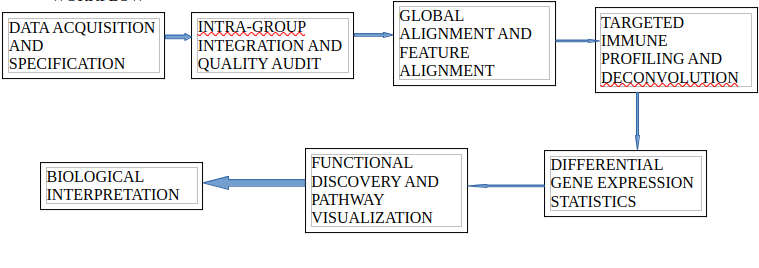

     T-CELL EXPRESSION ANALYSIS IN LUNG CANCER: A LUAD vs. LUSC Study

       Background
Non-Small Cell Lung Cancer (NSCLC) is primarily categorized into two histological subtypes:

Lung Adenocarcinoma (LUAD) and Lung Squamous Cell Carcinoma (LUSC). While they share a common organ of origin, 

their immunological landscapes are vastly different. Understanding the histological drivers of T-cell exclusion 

is critical for optimizing subtype-specific immunotherapy and understanding why certain tumors present as "immune deserts."

            Project Overview
This project performs a comparative transcriptomic analysis of 16 high-throughput datasets from The Cancer Genome Atlas (TCGA).
The study characterizes the T-cell marker expression, immune cell abundance, and biological pathways of 8 LUAD samples versus 8 LUSC
samples to delineate the molecular boundaries between these two histologies.

    Objectives

* Perform intra-group and global audits of LUAD and LUSC transcriptomic data.

* Standardize genetic features across histology-specific cohorts.

* Quantify and compare T-cell infiltration and deconvolution scores between subtypes.

* Identify histological drivers of immune activity via Differential Gene Expression (DGE).

* Map functional biological pathways unique to the LUAD and LUSC microenvironments.

     Workflow 

     Pipeline

1. Data Acquisition & Selection:

    Systematically filtering the TCGA-LUAD and TCGA-LUSC cohorts on the GDC Data Portal to select 16 primary tumor (TP) samples and generating the `accessions.txt` manifest.

2. Intra-Group Integration:

    Independent merging of the 8 LUAD and 8 LUSC files into subtype-specific matrices to establish histological baselines.

3. Quality Audit & Preprocessing:

      Scanning for null values (NaNs), removing zero-count genes, and cleaning Ensembl Gene IDs by stripping version decimal suffixes (e.g., `.15`).

4. Global Combination & Normalization:

      Integrating subtype matrices via an inner join followed by a global **Log2(CPM + 1)** transformation to ensure cross-subtype comparability.

5. Exploratory QC Visualization:

    Validating biological clustering and data consistency through **Principal Component Analysis (PCA)** and expression distribution boxplots.

6. Feature Mapping & Immune Profiling: 

    Utilizing the MyGene.info API to convert Ensembl IDs to Gene Symbols and extracting a canonical 10-gene T-cell signature for infiltration scoring.

7. Differential Gene Expression (DGE):

    Performing a formal statistical comparison of LUAD vs. LUSC using the **PyDESeq2** generalized linear model.

8. Functional Discovery & Visualization: 

    Executing pathway enrichment analysis (KEGG/GO) via **GSEApy Enrichr** and generating high-resolution **Volcano Plots**.

     Key Findings & Takeaways
         
* Histological Distinction:

 PCA confirms that LUAD and LUSC possess distinct global transcriptomic fingerprints despite shared organ origin. [View PCA Plot](figures/pca_16_samples.png)

* Immune Architecture:

 LUAD exhibits a more consistent immune-active microenvironment characterized by higher median T-cell infiltration scores. [View Subtype Comparison](figures/tcell_subtype_comparison_boxplot.png)

* T-Cell Signaling:

 Critical cytotoxic markers (CD8A, GZMB) show significant histological preference, revealing the "hot" vs "cold" nature of these tumors. [View Volcano Plot](figures/volcano_luad_vs_lusc.png)

* Proliferative Tradeoff:

 LUSC demonstrates a hyper-proliferative signature (mitotic spindle organization) which correlates with a "colder" or more excluded immune profile. [View LUSC Pathways](figures/pathways_LUSC_High_manual.png)

* Cellular Composition:

  Digital deconvolution reveals a higher abundance of cytotoxic lymphocytes in LUAD, while Macrophages remain a stable component in both histologies. [View Deconvolution Heatmap](figures/deconvolution_heatmap.png)

* Functional Mechanism:

   LUAD is significantly enriched in pathways related to antigen processing and apoptotic cell clearance. [View LUAD Pathways](figures/pathways_LUAD_High_manual.png)

      Repository Structure

.
├── data/               # Raw and audited count matrices (LUAD/LUSC)
├── scripts/            # Python scripts for auditing, DGE, and plotting
├── results/            # Statistical output tables (DEGs, enrichment scores)
├── figures/            # Generated QC plots, heatmaps, and volcano plots
├── accessions.txt      # List of TCGA Case IDs and File UUIDs
├── README.md           # General project documentation
├── .gitignore          # Files to exclude from version control
└── LICENSE             # MIT License

     Tools & Software
Language: Python 3.10+

Statistics: PyDESeq2, GSEApy

Data Handling: Pandas, NumPy

Visualization: Matplotlib, Seaborn, Bioinfokit

APIs: MyGene.info

CONTRIBUTORS
1. Mbaoji Florence Nwakaego
  Department of Pharmacology and Toxicology,
  Faculty of Pharmaceutical Sciences,
  University of Nigeria Nsukka,  Nsukka,  Enugu State, Nigeria

2. Chemutai Queen
  Department of Biochemistry,
  Faculty of Biomedical sciences,
  Jomo Kenyatta University of Agriculture and Technology, Kenya

3. John Nnaemeka Nkwocha
  Department of Biochemistry,
  University of Port Harcourt, Choba, River State, Nigeria.

4. Usman Yalwa.
  MSc Bioinformatics student at Kalinga University, India

5. Mark Matthew Edet
  Department of Morphological Veterinary Medicine, Chungbuk National University, South Korea.
  Department of Human Biochemistry, Faculty of Basic Medical Sciences,
  Nnamdi Azikiwe University, Nnewi, Nigeria.
6. Zilungile Coki
   SSc(HONS) Biotechnology student,
   University of the Western Cape, South Africa

7. Oluwaseun Martins Olowabi.
   Cancer Research and Molecular Biology,
  Department of Biochemistry, University of Ibadan

8. Valerie Martins
   department of cell biology and genetics,
   university of Lagos, Akoka

9. Olaitan I. Awe
   African Society for Bioinformatics and Computational Biology (ASBCB), Cape Town, South Africa
  Project Advisor
  
 ACKNOWLEDGEMENTS
We thank the NIH Office of Data Science Strategy for their support before and during the October 2026 Omics Codeathon, co-organized with the African Society for Bioinformatics and Com>
We also thank Dr. Awe for his ongoing guidance and all collaborators who contributed to this project.

